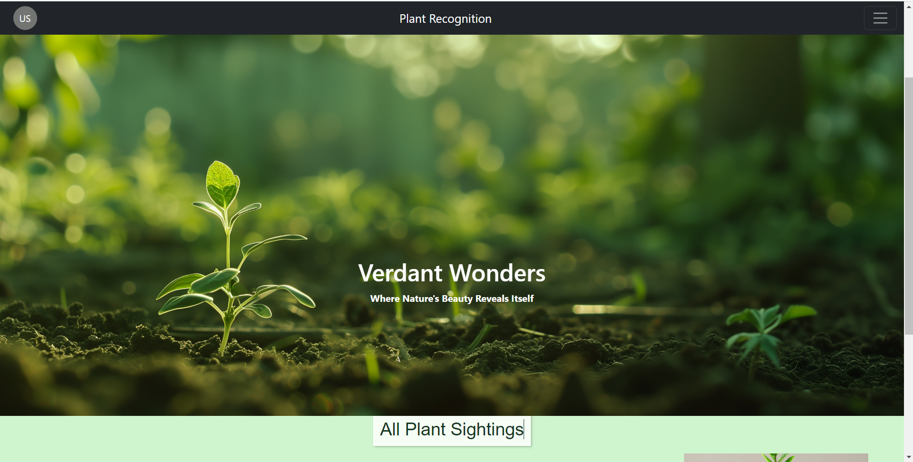

# MSC11 - Plant Recognition

## Description 

The Plant Recognition Web App is a platform designed to help users identify various plant species. Leveraging the DBPedia knowledge graph, the application provides users with valuable information about plants, including common names, scientific names, English language descriptions, and URIs linking to detailed DBPedia pages about each plant. Following are some main features provided by Plant Recognition : 

#### 1.Plant Information 
#### 2.Photo Gallery 
#### 3.User Engagement
#### 4.Comments and Discussions

## Installation

To run this project locally, you'll need to have Node.js, npm (Node Package Manager) and MongoDB installed on your machine. You can download and install them from 

- [Node.js](https://nodejs.org/)
- [MongoDB](https://www.mongodb.com/try/download/community)

### 1. Clone this repository to your local machine:

- git clone : <https://git.shefcompsci.org.uk/acp23rk/msc11-plant-recognition.git>

### 2. Navigate to the project directory  

- cd <project_directory>

### 3. Install dependencies using npm  

- npm install

### 4. Ensure MongoDB is running on your local machine. If it's not already running, start the MongoDB server.

### 5. Configure MongoDB connection

 - (MONGODB_URI=mongodb://localhost:27017/my_database)

### 6. Once the installation is complete and MongoDB is running, you can start the application 

- npm start

### 7. This will start the Node.js server using Express.js as the engine. You can access the application in your web browser at :
 - http://localhost:3000 .

### Screenshots 

### Wireframe

- https://www.figma.com/file/mUL9jkeoZYasACQbwSixAv/Plant-Recognition?type=design&node-id=0%3A1&mode=design&t=jP1DME0Lbuo9G4ju-1

### Bootstrap Components

- https://getbootstrap.com/docs/5.2/getting-started/introduction/
